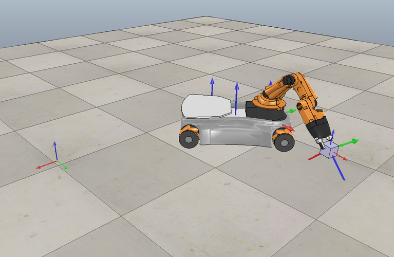

---
title: Mobile Manipulation Capstone
layout: default
filename: UBOT.md
remote_theme: pages-themes/cayman@v0.2.0
plugins:
- jekyll-remote-theme # add this line to the plugins list if you already have one
--- 
# Mobile Manipulation Capstone

## Overview
Developed a full planning and control system for a simulated youBot mobile manipulator. The robot autonomously executed a pick-and-place task by integrating kinematics, trajectory generation, and feedback control.

## How It Works

Kinematics & State Propagation: Implemented odometry and joint updates with speed constraints.

Trajectory Generation: Designed smooth, time-parameterized end-effector motions for pick-and-place.

Feedback Control: Combined feedforward twists with proportional–integral pose error correction using the system Jacobian.

Simulation: Logged configurations and errors to run in CoppeliaSim, validating accurate task completion.

## Impact

Demonstrated skills in robotics kinematics, control, and simulation while delivering a complete, functioning mobile manipulation system.

<br/>

## Program Components
{::options parse_block_html="true" /}

<details><summary markdown="span"><b>Component 1: Wrapper</b> (<i>click to expand</i>)</summary>

```
%% General
clear all
clc
close all
warning('off','all')
%%%%%%%%%%%%%%%%%%%%%%%%%%%%%%%%%%%%%%%%%%%%%%%%%%%%%%%%%%%%%%%%%%%%%%%%%%%%%%%%%%%%%%%%%%%%%%%%%%
%This code takes the initial inputs of joint angles, joint velocities, all
%fixed configuration (T) matrices, and control variables and generates a
%controlled trajectory for a pick and place UR5 robot.

%Using the input fixed configuration matrices, the desired trajectory is generated.
%Then, using forward kinematics and other fixed configuration
%matrices, the actual current initial configuration is calculated. Both are
%fed into the loop.

% In the loop, the current desired and next desired T matrices, feed into FeedbackControl
%along with actual current Tse matrix, arm joint angles, and controllers to get current
%error twist and joint velocities. Desired values are stored for plotting.
%It then takes current joint velocities and angles and feeds them into NextState to
%get out the current state of the robot. Using the current state, the
%new Tse configuration is calculated and fed back into FeedbackControl
%to restart the loop. This carries on until all trajectories have run
%through the loop.

%Running the Final.csv file in the CoppeliaSim Scene 6 will produce the
%desired pick and place task for any given block location.
%%%%%%%%%%%%%%%%%%%%%%%%%%%%%%%%%%%%%%%%%%%%%%%%%%%%%%%%%%%%%%%%%%%%%%%%%%%%%%%%%%%%%%%%%%%%%%%%%%
%% Initialization - Input Values Here

% Next state Initialization
    %arm joint angles
    a_angles = [0 .2 -1.9 -0.5 0];
    
    %chassis position and angle
    c_angles = [0 0 0];

    %wheel angles
    w_angles = [0 0 0 0];

    %arm joint velocities
    a_velocities = [0 0 0 0 0];

    %wheel velocities
    w_velocities = [0 0 0 0];
    
    %max joint speed
    vmax = 4*100;

% TrajectoryGenerator Initialization
    % Constant T between {b} and {0}
    Tb0=[1  0  0  .1662;...
         0  1  0    0;...
         0  0  1  .0026;...
         0  0  0    1];

    % e-e zero position
     M0e=[1  0  0 0.033 ;...
          0  1  0  0    ;...
          0  0  1 0.6546;...
          0  0  0  1   ];
    
    % Arm joint screw axes in {B} frame
    Blist = [[0 0 1 0 .033 0]'...
             [0 -1 0 -.5076 0 0]'...
             [0 -1 0 -.3526 0 0]' ...
             [0 -1 0 -.2176 0 0]' ...
             [0 0 1 0 0 0]'];
   
    % Desired e-e starting config
   Tse_d= [ 0  0  1  0;...
	        0  1  0  0;...
		    -1 0  0 0.5;...
	        0  0  0  1];

    % Initial cube config.
    Tsc_i=[1 0 0 .75;...
           0 1 0 .25;...
           0 0 1 0.025;...
           0 0 0 1];

    % Final cube config.
    Tsc_f=[0   1   0   0;...
           -1  0   0  -2;...
           0   0   1 .025;...
           0   0   0   1];

    % e-e Gripping config.
    Tce_g = [cosd(135)   0     sind(135)   0;...
              0        1         0       0;...
          -sind(135)   0     cosd(135)  0;...
              0        0         0       1];
 
    % e-e Standoff Config.
    Tce_sf=[cosd(135)   0     sind(135)  0;...
              0        1         0       0;...
          -sind(135)   0     cosd(135)  .1;...
              0        0         0       1];
    
   
    % Number of trajectory reference configs per 0.01s
    k = 10;
    
% FeedbackControl Initialization

    % Proportional control matrix
    Kp = 6*eye(6,6);

    % Integral control matrix
    Ki = .15*eye(6,6);

    % Time step
    dt = 0.01;

    % Initialize integral error
    Xerr_i=[0 0 0 0 0 0]';

%% Initial Calculations

    % Generate entire desired trajectory
    N_states = TrajectoryGenerator(Tse_d,Tsc_i,Tsc_f,Tce_g,Tce_sf,k);
       %Looping though N ref configurations
    N=size(N_states,1);


  %Calculate Initial e-e location/orientation
     % forward kinematics to find Toe
        Toe = FKinBody(M0e,Blist,a_angles');
     % chassis angles to fid Tsb   
        phi=c_angles(1);
        Tsb=    [cos(phi) -sin(phi) 0   c_angles(2);...
                 sin(phi)  cos(phi) 0   c_angles(3);...
                   0        0      1      .0963     ;...
                   0        0      0          1     ];
     %matrix multiplication to find Tse initial  
         Tse=Tsb*Tb0*Toe;
    
%% Start of The Loop
    

for i= 1:N-1

% Desired Trajectory - current
Tse_d =[N_states(i,1:3) N_states(i,10);...
        N_states(i,4:6) N_states(i,11);...
        N_states(i,7:9) N_states(i,12);...
          zeros(1,3)         1       ];

% Desired Trajectory - next
Tse_d_n =[N_states(i+1,1:3) N_states(i+1,10);...
          N_states(i+1,4:6) N_states(i+1,11);...
          N_states(i+1,7:9) N_states(i+1,12);...
           zeros(1,3)            1         ];

% Desired gripper state
g_state = N_states(i,13);


% Input desired state - output twist
[twist, w_velocities, a_velocities, Xerr_i,Xerr,Vd,mu_w,mu_v] = FeedbackControl(Tse,Tse_d,Tse_d_n,Kp,Ki,dt,Xerr_i,w_angles',a_angles);


% Store  error for plotting
Xerr_is(:,i)=Xerr_i;
Xerr_s(:,i) = Xerr;
Vd_s(:,i) = Vd;
twist_s(:,i) = twist;
Tse_d_s(:,:,i) = Tse_d;
Tse_s(:,:,i) = Tse;
mu_w_s(i) = mu_w;
mu_v_s(i) = mu_v;

% generate new state with updated twist
state(i,:) = NextState(c_angles,a_angles,w_angles,a_velocities,w_velocities,dt,vmax,g_state);

c_angles=state(i,1:3);
a_angles=state(i,4:8);
w_angles=state(i,9:12);


% Calcualte new Tse using updated state

Toe = FKinBody(M0e,Blist,a_angles');

phi=c_angles(1);
Tsb=    [cos(phi) -sin(phi) 0   c_angles(2);...
         sin(phi)  cos(phi) 0   c_angles(3);...
           0        0      1      .0963     ;...
           0        0      0          1     ];

 Tse=Tsb*Tb0*Toe;

end


state;
csvwrite('Final.csv',state)

%% Plots - Error Twist vs. time, Manipulability Factors (w,v) vs. time, Desired/Actual Tse vs. time

time = linspace(0,15,length(state));
% Error Twist vs. time
figure(2)
subplot(2,2,1:2)
title('Error Twist')
hold on
grid on
plot(time,Xerr_s(1,:))
plot(time,Xerr_s(2,:))
plot(time,Xerr_s(3,:))
plot(time,Xerr_s(4,:))
plot(time,Xerr_s(5,:))
plot(time,Xerr_s(6,:))
xlabel('Time of Simulation [s]')
ylabel('Error Twist')
legend('wx','wy','wz','vx','vy','vz')

%Manipulability Factors (w,v) vs. time
hold on
subplot(2,2,3)
plot(time, mu_w_s)
grid on
title('Rotational Manipulability mu_1(A_w)')
xlabel('Time of Simulation [s]')
subplot(2,2,4)
plot(time, mu_v_s)
grid on
title('Translational Manipulability mu_1(A_v)')
xlabel('Time of Simulation [s]')

% Desired/Actual Tse vs. time
figure(4)
hold on

% Subplot 1 of 3
subplot(1,3,1)
hold on
grid on
plot(time,squeeze(Tse_d_s(1,4,:)))
title('Desired X-position of e-e')
plot(time,squeeze(Tse_s(1,4,:)))
title('Actual X-position of e-e')
legend('Desired','Actual')
hold off

% Subplot 2 of 3
subplot(1,3,2)
hold on
grid on
plot(time,squeeze(Tse_d_s(2,4,:)))
title('Desired Y-position of e-e')
plot(time,squeeze(Tse_s(2,4,:)))
title('Actual Y-position of e-e')
legend('Desired','Actual')
hold off

% Subplot 3 of 3
subplot(1,3,3)
hold on
grid on
plot(time,squeeze(Tse_d_s(3,4,:)))
title('Desired Z-position of e-e')
plot(time,squeeze(Tse_s(3,4,:)))
title('Actual Z-position of e-e')
legend('Desired','Actual')
hold off
```
</details>
{::options parse_block_html="false" /}

{::options parse_block_html="true" /}

<details><summary markdown="span"><b>Component 2: Next State</b> (<i>click to expand</i>)</summary>

```
%% 1 - Kinematics Simulator
% uses the kinematics of the youBot to predict how the robot will move in a small timestep given
% its current configuration and velocity. 
% Inputs:
% • The current state of the robot (12 variables: 3 for chassis, 5 for arm, 4 for wheel angles)
% • The joint and wheel velocities (9 variables: 5 for arm ˙θ, 4 for wheels u)
% • The timestep size ∆t (1 parameter)
% • The maximum joint and wheel velocity magnitude (1 parameter)
% Outputs 
% • The next state (configuration) of the robot (12 variables)

function state = NextState(c_angles,a_angles,w_angles,a_velocities,w_velocities,dt,vmax,g_state)

%checking for maximum velocity
for b=1:length(a_velocities)
    if a_velocities(b)>=vmax || a_velocities(b)<=-vmax
        a_velocities(b) = vmax;
    elseif a_velocities(b)<=-vmax
        a_velocities(b) = -vmax;
    end
end

for c=1:length(w_velocities) 
    if w_velocities(c)>=vmax
        w_velocities(c) = vmax;
    elseif w_velocities(c)<=-vmax
        w_velocities(c)=-vmax;
    end
end

%euler step for arm and wheel angles
a_angles_n = a_angles + a_velocities*dt;

w_angles_n = w_angles + w_velocities*dt;

%euler step for chassis config
%odometry
r = 0.0475; %m
l = 0.47/2; %m
w = 0.3/2; %m

F = r/4*[-1/(l+w) 1/(l+w) 1/(l+w) -1/(l+w);
    1        1       1       1    ;
    -1        1      -1       1   ];

d_theta = w_velocities*dt;

Vb = zeros(1,6)';
Vb_i = F*d_theta';
Vb(3) = Vb_i(1);
Vb(4) = Vb_i(2);
Vb(5) = Vb_i(3);

% conditional for wbz = 0
if abs(Vb(3)) <= 1E-3
    d_qb = [   0   ;...
        Vb(4) ;...
        Vb(5)];
else
    d_qb = [                  Vb(3)                          ;...
        (Vb(4)*sin(Vb(3)) + Vb(5)*(cos(Vb(3) -1)))/Vb(3)  ;...
        (Vb(5)*sin(Vb(3)) + Vb(4)*(1 - cos(Vb(3))))/Vb(3)];
end
phi_k = c_angles(1);

dq = [1     0             0      ;
    0  cos(phi_k)  -sin(phi_k) ;
    0  sin(phi_k)   cos(phi_k) ] * d_qb;

c_angles_n = c_angles + dq';

%updated states
state = [c_angles_n a_angles_n w_angles_n g_state];

end

```
</details>
{::options parse_block_html="false" /}

{::options parse_block_html="true" /}

<details><summary markdown="span"><b>Component 3: Trajectory Generator</b> (<i>click to expand</i>)</summary>

```
%% 2 -TrajectoryGenerator to create the reference (desired) trajectory for the end-effector frame {e}. 
% Inputs
    % • The initial configuration of the end-effector: Tse,initial
    % • The initial configuration of the cube: Tsc,initial
    % • The desired final configuration of the cube: Tsc,f inal
    % • The configuration of the end-effector relative to the cube while grasping: Tce,grasp
    % • The standoff configuration of the end-effector above the cube, before and after grasping, relative to the cube:
    % Tce,standof f
    % • The number of trajectory reference configurations per 0.01 seconds: k. The value k is an integer with a value
    % of 1 or greater. 1
% Outputs
    % • A representation of the N configurations of the end-effector along the entire concatenated eight-segment reference trajectory. Each of these N reference points represents a transformation matrix Tse of the end-effector
    % frame {e} relative to {s} at an instant in time, plus the gripper state (0 for open or 1 for closed). These
    % reference configurations will be used by your controller. Note: if your trajectory takes t seconds, your function
    % should generate N = t · k/0.01 configurations.
    % • A .csv file with the entire eight-segment reference trajectory. Each line of the .csv file corresponds to one
    % configuration Tse of the end-effector, expressed as 13 variables separated by commas. The 13 variables are, in
    % order:
    % r11, r12, r13, r21, r22, r23, r31, r32, r33, px, py, pz, gripper state
function Configurations = TrajectoryGenerator(Tse_d,Tsc_i,Tsc_f,Tce_g,Tce_sf,k)

    %Trajectory Selections
    method=5;%(3 for cubic, 5 for quintic)
   
    
    t_l=6;%seconds large movement takes
    t_s=.75;%seconds small movement takes

    N_l=t_l*k/.01;%number of large movement 
    N_s=t_s*k/.01;%number of small movement 
 

    % 1 - gripper initial position to standoff initial open
    traj_1 = ScrewTrajectory(Tse_d,Tsc_i*Tce_sf,t_l,N_l,method);
    
    % 2 - standoff initial open to grip open
    traj_2 = ScrewTrajectory(Tsc_i*Tce_sf,Tsc_i*Tce_g,t_s,N_s,method);
    
    % 4 - grip close to standoff initial
    traj_4 = ScrewTrajectory(Tsc_i*Tce_g,Tsc_i*Tce_sf,t_s,N_s,method);
    
    % 5 - standoff initial close to standoff close final
    traj_5 = ScrewTrajectory(Tsc_i*Tce_sf,Tsc_f*Tce_sf,t_l,N_l,method);
    
    % 6 - standoff final close to grip close
    traj_6 = ScrewTrajectory(Tsc_f*Tce_sf,Tsc_f*Tce_g,t_s,N_s,method);
    
    % 8 - grip 2 open to standoff 2 open
    traj_8 = ScrewTrajectory(Tsc_f*Tce_g,Tsc_f*Tce_sf,t_s,N_s,method);
    


    for i = 1:N_l
        %1 - gripper initial position to standoff 1 open
        step1 = traj_1{1,i};
        traj1(i,:) = [step1(1,1:3) step1(2,1:3) step1(3,1:3) step1(1:3,4)' 0];
    
        %5 - standoff 1 close to standoff 2 close
        step5 = traj_5{1,i};
        traj5(i,:) = [step5(1,1:3) step5(2,1:3) step5(3,1:3) step5(1:3,4)' 1];
    end

    for i = 1:N_s
        %2 - standoff 1 open to grip open
        step2 = traj_2{1,i};
        traj2(i,:) = [step2(1,1:3) step2(2,1:3) step2(3,1:3) step2(1:3,4)' 0];
       
        %4 - grip close to standoff 1 close
        step4 = traj_4{1,i};
        traj4(i,:) = [step4(1,1:3) step4(2,1:3) step4(3,1:3) step4(1:3,4)' 1];

         %6 - standoff 2 close to grip 2 close
         step6 = traj_6{1,i};
        traj6(i,:) = [step6(1,1:3) step6(2,1:3) step6(3,1:3) step6(1:3,4)' 1];
    
        %8 - grip 2 open to standoff 2 open
        step8 = traj_8{1,i};
        traj8(i,:) = [step8(1,1:3) step8(2,1:3) step8(3,1:3) step8(1:3,4)' 0];
           %3 - grip open to grip close
        
    end
        traj3(1,:) = [step2(1,1:3) step2(2,1:3) step2(3,1:3) step2(1:3,4)' 1];

        %7 - grip 2 close to grip 2 open
        traj7(1,:) = [step6(1,1:3) step6(2,1:3) step6(3,1:3) step6(1:3,4)' 0];
     
        
    Configurations = [traj1; traj2; traj3; traj4; traj5; traj6; traj7; traj8];
    csvwrite('test_part_2',Configurations)
```
</details>
{::options parse_block_html="false" /}

{::options parse_block_html="true" /}

<details><summary markdown="span"><b>Component 4: Feedback Control</b> (<i>click to expand</i>)</summary>

```
%% 3 - FeedbackControl  calculates the task-space feedforward plus feedback control law discussed in class
% Inputs
    % • The current actual end-effector configuration X (aka Tse)
    % • The current reference end-effector configuration Xd (aka Tse,d)
    % • The reference end-effector configuration at the next timestep, Xd,next (aka Tse,d,next)
    % • The PI gain matrices Kp and Ki
    % • The timestep ∆t between reference trajectory configurations
% Outputs
    % • The commanded end-effector twist V expressed in the end-effector frame {e} (for plotting purposes).
    % • The commanded wheel speeds, u and the commanded arm joint speeds, ˙θ

function [twist, w_velocities, a_velocities,Xerr_i,Xerr,Vd,mu_w,mu_v] = FeedbackControl(Tse,Tse_d,Tse_d_n,Kp,Ki,dt,Xerr_i,w_angles ,a_angles)


%adjoint
adj = Adjoint(TransInv(Tse)*Tse_d);

%error twist
Xerr = se3ToVec(MatrixLog6(TransInv(Tse)*Tse_d));

%integral error
Xerr_i= Xerr*dt + Xerr_i;

%desired twist
Vd = se3ToVec(1/dt*MatrixLog6(TransInv(Tse_d)*Tse_d_n));

%updated twist
V = adj*Vd + Kp*Xerr + Ki*Xerr_i;


%Jacobian
    % arm Jacobian
    thetalist = a_angles';
    Blist = [[0 0 1 0 .033 0]' ...
             [0 -1 0 -.5076 0 0]' ...
             [0 -1 0 -.3526 0 0]' ...
             [0 -1 0 -.2176 0 0]' ...
             [0 0 1 0 0 0]'];
    J_arm = JacobianBody(Blist,thetalist);
    
    % base Jacobian
    Tb0 = [1 0 0 .1662 ;...
           0 1 0   0   ;...
           0 0 1 0.0026;...
           0 0 0   1  ];

    M0e = [1 0 0 0.033 ;...
           0 1 0   0   ;...
           0 0 1 0.6546;...
           0 0 0   1  ];
    Toe_theta=FKinBody(M0e,Blist,thetalist);

    adj2 = Adjoint(TransInv(Toe_theta)*TransInv(Tb0));
    r = 0.0475; l = 0.47/2; w = 0.3/2; %m
    
    F = r/4*[-1/(l+w) 1/(l+w) 1/(l+w) -1/(l+w);...
                1        1       1       1    ;...
               -1        1      -1       1   ];...
    
    F6 = [zeros(1,length(F));...
          zeros(1,length(F));...
                   F;...
          zeros(1,length(F))];

    J_base = adj2*F6;

J = [J_base J_arm];

%manipulability values
Jw = J(1:3,:);
Aw = Jw*Jw';
lw = eig(Aw);
lw_max = max(lw);
lw_min = min(lw);
mu_w = sqrt(lw_max)/sqrt(lw_min);

Jv = J(4:6,:);
Av = Jv*Jv';
lv = eig(Av);
lv_max = max(lv);
lv_min = min(lv);
mu_v = sqrt(lv_max)/sqrt(lv_min);

% velocities
vel = pinv(J,.0001)*V;

twist=V;

w_velocities=vel(1:4)';
a_velocities=vel(5:9)';
end
```
</details>
{::options parse_block_html="false" /}
